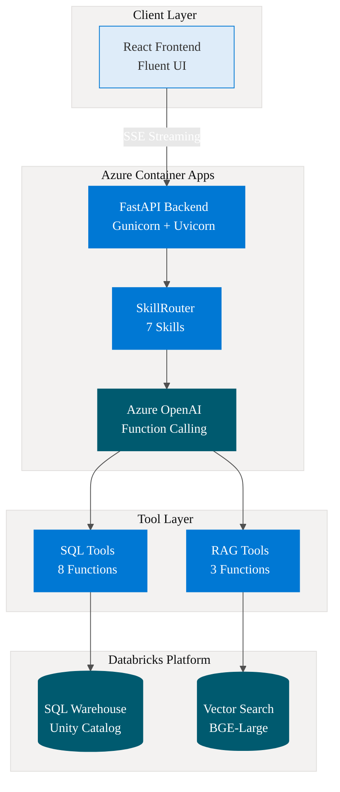
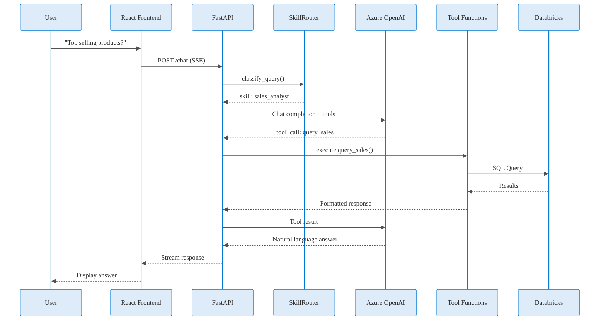
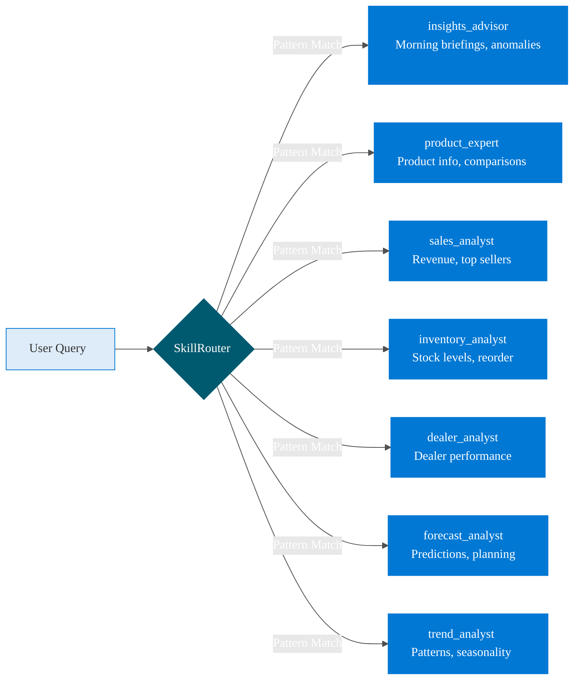
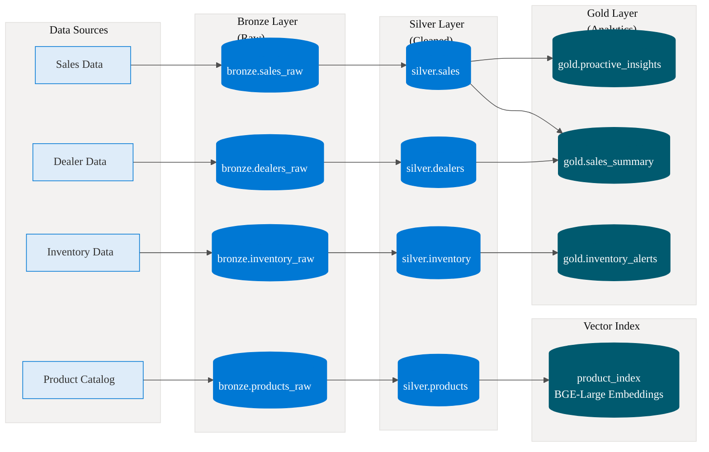

# STIHL Analytics Agent 🪓

An AI-powered analytics platform for STIHL power equipment data, featuring natural language querying, proactive insights, anomaly detection, and semantic product search.

[](https://azure.microsoft.com)
[](https://databricks.com)
[](https://azure.microsoft.com/en-us/products/ai-services/openai-service)
[](https://react.dev)

**🔗 Live Demo:** [ca-stihl-rnofgqn7g5tzm.happyrock-6ed25c83.westus2.azurecontainerapps.io](Available upon request)

---

## 📋 Table of Contents

- [Overview](#overview)
- [Key Features](#key-features)
- [Architecture](#architecture)
- [Technology Stack](#technology-stack)
- [Skills & Tools](#skills--tools)
- [Data Architecture](#data-architecture)
- [Getting Started](#getting-started)
- [Deployment](#deployment)
- [Demo Queries](#demo-queries)
- [Project Structure](#project-structure)
- [Cost Estimates](#cost-estimates)

---

## Overview

The STIHL Analytics Agent is a full-stack AI application that transforms how users interact with business data. Instead of writing SQL queries or navigating dashboards, users simply ask questions in natural language and receive intelligent, contextual responses.

### What Makes This Project Unique

| Capability | Description |
|------------|-------------|
| **Proactive Insights** | Automatically surfaces anomalies and important trends without being asked |
| **Hybrid Intelligence** | Combines structured SQL queries with semantic vector search |
| **Skill-Based Routing** | Intelligent query classification routes requests to specialized handlers |
| **Real-Time Data** | Queries live Databricks warehouse—no cached or mock responses |
| **Production-Ready** | Fully containerized and deployed on Azure Container Apps |

---

## Key Features

### 🎯 Natural Language Analytics
Ask questions like "What are our top selling products in California?" and get instant answers with real data.

### 🔍 Semantic Product Search
Uses vector embeddings (BGE-Large) to understand product queries contextually. "Best chainsaw for professionals" returns relevant products based on meaning, not just keywords.

### ⚠️ Anomaly Detection
Proactively identifies unusual patterns in sales, inventory, and dealer performance, surfacing them in morning briefings.

### 📊 Multi-Domain Intelligence
Seven specialized skills covering sales analysis, inventory management, product expertise, dealer performance, forecasting, and trend analysis.

---

## Architecture

### High-Level System Architecture



### Request Flow Architecture



### Detailed Component Architecture

```mermaid
%%{init: {'theme': 'base', 'themeVariables': { 'primaryColor': '#0078D4', 'primaryTextColor': '#ffffff', 'primaryBorderColor': '#0078D4', 'lineColor': '#505050', 'secondaryColor': '#E8E8E8', 'tertiaryColor': '#F3F2F1', 'fontFamily': 'Segoe UI, sans-serif'}}}%%
flowchart TB
    subgraph Frontend["Frontend Layer"]
        React[React 18]
        Fluent[Fluent UI v9]
        Chat[Chat Component<br/>SSE Streaming]
    end

    subgraph Backend["Backend Layer"]
        FastAPI[FastAPI<br/>REST API]
        Gunicorn[Gunicorn<br/>Process Manager]
        
        subgraph Skills["Skills Framework"]
            IA[insights_advisor]
            PE[product_expert]
            SA[sales_analyst]
            INV[inventory_analyst]
            DA[dealer_analyst]
            FA[forecast_analyst]
            TA[trend_analyst]
        end
        
        subgraph ToolRegistry["Tool Registry (11 Tools)"]
            subgraph SQLTools["SQL Tools"]
                T1[query_sales]
                T2[query_inventory]
                T3[get_insights]
                T4[detect_anomalies]
                T5[get_briefing]
                T6[query_dealer]
                T7[get_forecast]
                T8[analyze_trends]
            end
            subgraph RAGTools["RAG Tools"]
                T9[search_products]
                T10[compare_products]
                T11[get_recommendations]
            end
        end
    end

    subgraph Azure["Azure Services"]
        AOAI[Azure OpenAI<br/>gpt-5-mini]
        ACA[Container Apps]
        ACR[Container Registry]
    end

    subgraph Databricks["Databricks Platform"]
        subgraph Unity["Unity Catalog"]
            Bronze[(Bronze Layer<br/>Raw Data)]
            Silver[(Silver Layer<br/>Cleaned Data)]
            Gold[(Gold Layer<br/>Analytics)]
        end
        SQLEndpoint[SQL Warehouse]
        VectorEndpoint[Vector Search<br/>Endpoint]
        VectorIndex[(Product Index<br/>BGE-Large)]
    end

    React --> Chat
    Fluent --> React
    Chat -->|HTTP/SSE| FastAPI
    FastAPI --> Skills
    Skills --> ToolRegistry
    ToolRegistry --> AOAI
    SQLTools --> SQLEndpoint
    RAGTools --> VectorEndpoint
    SQLEndpoint --> Unity
    VectorEndpoint --> VectorIndex
    ACA --> FastAPI
    ACR --> ACA

    style Frontend fill:#F3F2F1,stroke:#E1DFDD,stroke-width:1px
    style Backend fill:#F3F2F1,stroke:#E1DFDD,stroke-width:1px
    style Azure fill:#F3F2F1,stroke:#E1DFDD,stroke-width:1px
    style Databricks fill:#F3F2F1,stroke:#E1DFDD,stroke-width:1px
    style Skills fill:#E8E8E8,stroke:#D1D1D1,stroke-width:1px
    style ToolRegistry fill:#E8E8E8,stroke:#D1D1D1,stroke-width:1px
    style SQLTools fill:#DEECF9,stroke:#0078D4,stroke-width:1px
    style RAGTools fill:#DEECF9,stroke:#0078D4,stroke-width:1px
    style Unity fill:#E8E8E8,stroke:#D1D1D1,stroke-width:1px
    style React fill:#DEECF9,stroke:#0078D4,stroke-width:1px,color:#323130
    style Fluent fill:#DEECF9,stroke:#0078D4,stroke-width:1px,color:#323130
    style Chat fill:#DEECF9,stroke:#0078D4,stroke-width:1px,color:#323130
    style FastAPI fill:#0078D4,stroke:#0078D4,stroke-width:1px,color:#ffffff
    style Gunicorn fill:#0078D4,stroke:#0078D4,stroke-width:1px,color:#ffffff
    style IA fill:#0078D4,stroke:#0078D4,stroke-width:1px,color:#ffffff
    style PE fill:#0078D4,stroke:#0078D4,stroke-width:1px,color:#ffffff
    style SA fill:#0078D4,stroke:#0078D4,stroke-width:1px,color:#ffffff
    style INV fill:#0078D4,stroke:#0078D4,stroke-width:1px,color:#ffffff
    style DA fill:#0078D4,stroke:#0078D4,stroke-width:1px,color:#ffffff
    style FA fill:#0078D4,stroke:#0078D4,stroke-width:1px,color:#ffffff
    style TA fill:#0078D4,stroke:#0078D4,stroke-width:1px,color:#ffffff
    style T1 fill:#0078D4,stroke:#0078D4,stroke-width:1px,color:#ffffff
    style T2 fill:#0078D4,stroke:#0078D4,stroke-width:1px,color:#ffffff
    style T3 fill:#0078D4,stroke:#0078D4,stroke-width:1px,color:#ffffff
    style T4 fill:#0078D4,stroke:#0078D4,stroke-width:1px,color:#ffffff
    style T5 fill:#0078D4,stroke:#0078D4,stroke-width:1px,color:#ffffff
    style T6 fill:#0078D4,stroke:#0078D4,stroke-width:1px,color:#ffffff
    style T7 fill:#0078D4,stroke:#0078D4,stroke-width:1px,color:#ffffff
    style T8 fill:#0078D4,stroke:#0078D4,stroke-width:1px,color:#ffffff
    style T9 fill:#0078D4,stroke:#0078D4,stroke-width:1px,color:#ffffff
    style T10 fill:#0078D4,stroke:#0078D4,stroke-width:1px,color:#ffffff
    style T11 fill:#0078D4,stroke:#0078D4,stroke-width:1px,color:#ffffff
    style AOAI fill:#005A6F,stroke:#005A6F,stroke-width:1px,color:#ffffff
    style ACA fill:#005A6F,stroke:#005A6F,stroke-width:1px,color:#ffffff
    style ACR fill:#005A6F,stroke:#005A6F,stroke-width:1px,color:#ffffff
    style Bronze fill:#005A6F,stroke:#005A6F,stroke-width:1px,color:#ffffff
    style Silver fill:#005A6F,stroke:#005A6F,stroke-width:1px,color:#ffffff
    style Gold fill:#005A6F,stroke:#005A6F,stroke-width:1px,color:#ffffff
    style SQLEndpoint fill:#0078D4,stroke:#0078D4,stroke-width:1px,color:#ffffff
    style VectorEndpoint fill:#0078D4,stroke:#0078D4,stroke-width:1px,color:#ffffff
    style VectorIndex fill:#005A6F,stroke:#005A6F,stroke-width:1px,color:#ffffff
```



---

## Technology Stack

### Frontend
| Technology | Purpose |
|------------|---------|
| React 18 | UI Framework |
| Fluent UI v9 | Microsoft Design System |
| TypeScript | Type Safety |
| Vite | Build Tool |
| SSE (Server-Sent Events) | Real-time Streaming |

### Backend
| Technology | Purpose |
|------------|---------|
| Python 3.11 | Runtime |
| FastAPI | REST API Framework |
| Gunicorn + Uvicorn | Production Server |
| Azure OpenAI SDK | LLM Integration |
| databricks-sql-connector | Warehouse Access |
| databricks-vectorsearch | Semantic Search |

### Infrastructure
| Service | Purpose |
|---------|---------|
| Azure Container Apps | Application Hosting |
| Azure Container Registry | Image Storage |
| Azure OpenAI | GPT-5-mini Model |
| Databricks SQL Warehouse | Data Warehouse |
| Databricks Vector Search | Embeddings Search |
| Unity Catalog | Data Governance |

---

## Skills & Tools

### Skills Framework

The SkillRouter uses pattern matching with confidence scoring to classify user queries and route them to specialized handlers.



### Tool Descriptions

| Tool | Type | Description |
|------|------|-------------|
| `query_sales` | SQL | Query sales transactions with filters |
| `query_inventory` | SQL | Check stock levels and inventory status |
| `get_insights` | SQL | Retrieve pre-computed business insights |
| `detect_anomalies` | SQL | Find unusual patterns in data |
| `get_briefing` | SQL | Generate executive summaries |
| `query_dealer` | SQL | Analyze dealer performance metrics |
| `get_forecast` | SQL | Retrieve demand forecasts |
| `analyze_trends` | SQL | Identify seasonal and temporal patterns |
| `search_products` | RAG | Semantic product search |
| `compare_products` | RAG | Side-by-side product comparison |
| `get_recommendations` | RAG | AI-powered product suggestions |

---

## Data Architecture

### Medallion Architecture



### Data Volumes

| Layer | Table | Record Count |
|-------|-------|--------------|
| Silver | sales | 562,000+ |
| Silver | inventory | 126,000+ |
| Silver | products | 500+ |
| Gold | proactive_insights | Dynamic |

---

## Getting Started

### Prerequisites

- Python 3.11+
- Node.js 18+
- Azure subscription
- Databricks workspace with Unity Catalog
- Azure OpenAI deployment (gpt-5-mini)

### Environment Variables

Create a `.env` file with:

```env
# Azure OpenAI
AZURE_OPENAI_ENDPOINT=https://your-endpoint.openai.azure.com/
AZURE_OPENAI_API_KEY=your-api-key
AZURE_OPENAI_DEPLOYMENT_GPT=gpt-5-mini

# Databricks
DATABRICKS_HOST=https://your-workspace.azuredatabricks.net
DATABRICKS_HTTP_PATH=/sql/1.0/warehouses/your-warehouse-id
DATABRICKS_TOKEN=your-databricks-pat
DATABRICKS_CATALOG=stihl_lakehouse

# Vector Search
DATABRICKS_VECTOR_SEARCH_ENDPOINT=stihl-vector-endpoint
DATABRICKS_VECTOR_INDEX=product_index
```

### Local Development

```bash
# Clone repository
git clone https://github.com/blanskiy/stihl-agent-ui.git
cd stihl-agent-ui

# Backend setup
cd src/api
python -m venv .venv
.venv\Scripts\activate  # Windows
pip install -r ../requirements.txt
uvicorn main:app --reload --port 8000

# Frontend setup (new terminal)
cd src/frontend
npm install
npm run dev
```

Access the application at `http://localhost:5173`

---

## Deployment

### Azure Container Apps Deployment

```bash
# Login to Azure
az login
azd auth login

# Initialize environment
azd init
azd env new stihl-prod

# Set environment variables
azd env set AZURE_OPENAI_ENDPOINT "your-endpoint"
azd env set DATABRICKS_HOST "your-host"
# ... set all required variables

# Deploy
azd deploy
```

### View Logs

```bash
az containerapp logs show \
  --name ca-stihl-rnofgqn7g5tzm \
  --resource-group rg-ai-foundry-learning \
  --type console \
  --tail 100
```

---

## Demo Queries

Try these queries to explore the agent's capabilities:

| Query | Skill Activated | What It Demonstrates |
|-------|-----------------|----------------------|
| "Good morning! What should I know today?" | insights_advisor | Proactive anomaly detection |
| "What are the top selling products?" | sales_analyst | SQL aggregation queries |
| "Best chainsaw for professionals?" | product_expert | RAG/Vector search |
| "Compare MS 500i vs MS 462" | product_expert | Product comparison |
| "Low stock items that need reordering?" | inventory_analyst | Inventory alerts |
| "How is dealer performance in California?" | dealer_analyst | Regional analysis |
| "What are the seasonal trends for trimmers?" | trend_analyst | Time-series analysis |

---

## Project Structure

```
stihl-agent-ui/
├── src/
│   ├── api/
│   │   ├── agent/
│   │   │   ├── skills/
│   │   │   │   └── router.py          # SkillRouter implementation
│   │   │   └── tools/
│   │   │       ├── sql_tools.py       # SQL query tools
│   │   │       └── rag_tools.py       # Vector search tools
│   │   ├── routes.py                  # API endpoints
│   │   └── main.py                    # FastAPI application
│   ├── frontend/
│   │   ├── src/
│   │   │   ├── components/            # React components
│   │   │   └── App.tsx                # Main application
│   │   └── package.json
│   ├── Dockerfile                     # Container configuration
│   ├── requirements.txt               # Python dependencies
│   └── gunicorn.conf.py              # Production server config
├── infra/
│   └── main.bicep                     # Azure infrastructure as code
└── README.md
```

---

## Cost Estimates

### Monthly Azure Costs

| Service | Estimated Cost |
|---------|----------------|
| Container Apps (Consumption) | $15-30 |
| Container Registry | $5 |
| Log Analytics | $5 |
| **Total Azure** | **~$25-40/month** |

### Databricks Costs (Separate)

- SQL Warehouse: Pay per query (DBU consumption)
- Vector Search: Included with Unity Catalog

---

## Future Enhancements

- [ ] Azure AD B2C Authentication
- [ ] Application Insights Monitoring
- [ ] Multi-turn Conversation Memory
- [ ] Export Reports to PDF/Excel
- [ ] Mobile-Responsive Design
- [ ] Dark Mode Support

---

## Author

**Bruce Lanskiy** - Data Architect  
Building enterprise solutions with Azure, Databricks, and modern web technologies.

---

## License

This project is for portfolio demonstration purposes.

---

*Last Updated: January 16, 2026*
